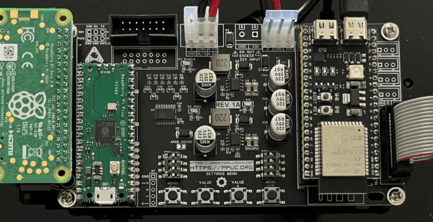
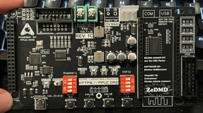

# PPUC-DMD

PPUC-DMD is a ZeDMD capable of displaying Serum v1 and v2 colorizations on real pinball machines. 

## The hardware components
Currently the hardware consists out of 4 main components:

- Raspberry Pi
- RP2040
- ESP32-S3-N16R8
- PPUC-DMD Carrier PCB

> **IMPORTANT!**
>
> During the distribution of PPUC-DMD units between July 2025 and November 2025, two main variants have been in circulation. One is a PPUC-DMD Carrier PCB with a Raspberry Pi Pico attached via soldered pin headers (REV. 1A & REV. 1B), while the other has the Pico directly integrated into the carrier board (REV. 1C). The software update procedure differs slightly between these two versions, so please pay attention to which variant you are working with.

See both variants here: 

## The software components
PPUC-DMD consists out of 3 seperate software pieces:

* DMDreader (Pico/RP2040)
    * Reads DMD frames and sends to ZeDMDos
* ZeDMDos (Raspberry Pi)
    * Colorizes the DMD frames and sends data to ZeDMD
* ZeDMD (ESP32-S3-N16R8)
    * Sends out color data to the RGB panels

## Updating the software
Updating the software of PPUC/DMD is rather simple. What will be required for these steps is the following:

1. Micro SD card reader 
2. USB-C to USB-A or Micro USB to USB-A cable (depending on USB port leading to RP2040/Pico)
3. Basic computer skills 

First we will start off with updating DMDreader. Then updating ZeDMDos. Lastly there is a mini tutorial on how to install or update colorization files.

### Updating DMDreader
1. Download the latest file. This file is what will be flashed  onto the RP2040 chip. [Click this link to download file.](https://drive.usercontent.google.com/uc?id=1a3X7LJjNwEYenm08rg9z6rdp6sjTPe5c&export=download) You should now have a file named `dmdreader.uf2` in your downloads folder.
2. Grab a USB cable. For most this will be a USB-C to USB-A cable. Others might need Micro USB to USB-A. 
3. Make sure game is turned off, in case of owning a REV. 1A/B board, you must remove the Raspberry Pi Pico/RP2040 from the PPUC/DMD carrier PCB! (This is the tiny green board) When owning a REV. 1C board, you can lay the DMD down for easy access to the USB-C port.
4. On the RP2040/Pico microcontroller and REV. 1C board, you'll find a button labeled `BOOTSEL`. This button enables software flashing mode. [Watch this video for a demonstration!](https://www.youtube.com/watch?v=os4mv_8jWfU) To enter this mode, hold down the `BOOTSEL` button while connecting the USB cable from your computer to the RP2040/Pico. Once connected, a folder should appear on your computer named `RP2-B2`.
5. Drag and drop the `dmdreader.uf2` file into that folder, which was obtained in step 1. Wait a few seconds until the `RP2-B2` folder closes. 
6. End of DMDreader flashing. Remove USB cable and in cases of REV. 1A/B boards, plug the RP2040/Pico back into the PPUC/DMD carrier board. Make sure all pins line up correctly! 

### Updating ZeDMDos and installing or updating the colorization file
Updating ZeDMDos requires a bit more work compared to DMDreader. Skip to step 5 when only wanting to install or update a colorization file

1. Take a look at your Raspberry Pi, this is the bigger green board which is upside down over to the left. There should be a specific number on there, ranging from 1-45. This number tells you which software file you need to install in step 2.
2. Install the required files. [Click here to go to the folder!](https://www.youtube.com/watch?v=os4mv_8jWfU) Having kept the number from step 1 mind, go to the `ZeDMDos software files` folder and download `YourNumberHere.zip`. 
3. All colorization files have received an update which decreases the loading time marginally. From the `Colorizations` folder, click on the colorization of choice and download the `serum.cROMc` file. Keep this file as is and do not rename it.
4. Take the Micro SD card out of your Raspberry Pi. __IMPORTANT: the supporter editions are hardware protected, you have to reuse the same SD card!__ Now get a MicroSD card reader, or a laptop which has the correct slot built in. Boot up your PC or laptop and insert the MicroSD card. [Click here for a video on how to update the ZeDMDos software!](https://drive.google.com/file/d/12rZP5NDtXh-hpvE5iITfu5ZzG9rINzXC/view)
5. Installing a new colorization file is easy. Get the desired file, ideally a `.cROMc` file, `.cRZ` is also supported, though needs to be converted into a `.cROM` by extracting the `.cRZ` file as if it is a zip file. In all cases the final name of the file should be either `serum.cROMc` or `serum.cROM`. Case sensitivity matters here! __Failing to follow these guidelines will result in black and white DMD output.__
6. When you have your file ready and waiting, open up the `colorizations` folder on your Micro SD card, then navigate to the `serum` folder. This is where you will place your `serum.cROMc` or `serum.cROM` file. Be sure to delete any previous files, or simply overwrite an existing one. You shouldn't have multiple files next to eachother in the `serum` folder. 

End of installation. Now plug your Micro SD card back into your Raspberry Pi. And of course, boot up the game to see if all is well :)