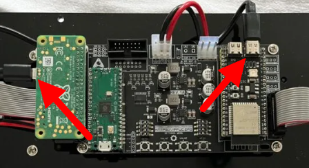
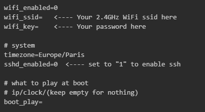

# When things don't work (Supporter Edition)
Now that there are several PPUC/DMD's in circulation, it might happen that you stumble into an issue. Especially because the Supporter Edition has 3 main processors, all communicating with each other to achieve a goal.  
In this document, basic troubleshooting steps will be presented, along with a more advanced one where logging into the Raspberry Pi through SSH is required.

## Issue #1 - Red spinner appears bottom right after boot
PPUC/DMD relies on data transfer through the USB cable. There have been a few reports where the end result was a faulty USB cable, or one that simply did not make good contact half the time.

**BEHAVIOUR:** PPUC/DMD will turn on and display the ZeDMD logo. But later on it will go to the PPUC logo as well, then a red spinner will appear at the bottom right.

> **FIX 1:** Of course, turn off the pinball machine first. Turn the USB-C cable by 180 degrees. If that does not work, it's worth trying a different USB cable to see if that solves the problem.

> **FIX 2:** Be sure both ends of the USB cable are in the correct position. Both the Raspberry Pi Zero 2W and the ESP32-S3 have two USB ports. Only one on both will work. It is the right port on the ESP32-S3 if the buttons are closest to you, and the USB port closest to you on the Pi Zero 2W if again the buttons are closest to you. See picture below:  

## Issue #2 - Not all frames in the colorization display
**BEHAVIOUR:** Frames will flicker, almost no frames containing text show up, and the display will freeze.

> **FIX:** Set the game's language to English. There is no Serum file in existence that has been done for anything other than the English game ROM. So, go into the settings menu or change the dipswitch of the pinball machine.

## Issue #3 - ZeDMD logo shows and boots into a blank screen
There are multiple reasons this could happen, but whenever the ZeDMD logo shows up and then after ~8 seconds it goes to a blank screen without the red spinner appearing at the bottom right, it means the Raspberry Pi communicated successfully with the ESP32-S3 (ZeDMD).

**BEHAVIOUR:** When turning the game on, the ZeDMD logo will show and it initiates but also doesn't. No frames appear on the DMD.

> **FIX 1:** Check if the ribbon cable is correctly inserted. A ribbon cable can never damage PPUC/DMD's components, so if you aren't sure, you can adjust its position without having to be afraid. Rebooting the game is a strict requirement after reseating the ribbon cable or swapping it around.  
If that doesn't seem to solve things, we have to be sure the firmware is correctly flashed onto the Raspberry Pi Pico chip, as this one reads out the real pinball DMD signals and reports it to the Raspberry Pi.  
See ["Updating DMDreader"](https://ppuc.github.io/docs/ppuc_dmd/#updating-dmdreader). If that does not fix the issue, have a look at the debugging steps below.

### Issue #3 - Debugging the Pico
The fix from above did not seem to solve anything, so at this point logging into the Pi to gain more knowledge about what is really going on with the communication is the only way, as the Pi sort of sits in-between the Pico and the ESP32-S3, this is the only way. 

Step 1: Turn of the pinball machine and take out the MicroSD card from the Raspberry Pi, insert it into your PC with a MicroSD card reader or whatever else works. 
Step 2: Upon loading the contents of the MicroSD, navigate to the folder "configs" click on the folder, you should see two files: `ppuc-dmd.ini` and `zedmdos.ini`. We will be opening the `zedmdos.ini` file. So double click on the file.
You should see the following contents, arrows have been placed where you need to fill out specific entires. 

Step 3: Having filled in your specific settings in the file, save it and insert the MicroSD card back into your game. Now boot the game and figure out on what IP the Pi is running, often it will show up as a "*" for its name. 
Step 4: With the IP figured out ssh into it, the username when prompted is `root`, the password is `linux`. When entered correctly, you should successfully be in the command line. 